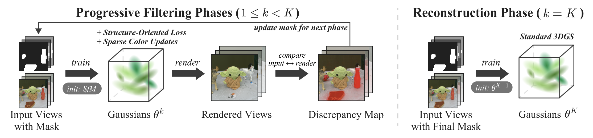

<h1 align="center">PDF-GS: Progressive Distractor Filtering<br/>for Robust 3D Gaussian Splatting</h1>

<p align="center">
<a href="https://kangrnin.github.io">Kangmin Seo</a>,
<a href="https://2minkyulee.github.io/">MinKyu Lee</a>,
<a href="https://vanmeruso.github.io/">Tae-Young Kim</a>,
ByeongCheol Lee,
JoonSeoung An,
<a href="https://sites.google.com/site/jaepilheo">Jae-Pil Heo</a><br/>
Sungkyunkwan University
</p>

<h4 align="center">CVPR 2026 Findings</h4>

<p align="center">
  <a href="https://kangrnin.github.io/PDF-GS/"></a>
  &nbsp;
  <a href="https://arxiv.org/abs/2604.12580"></a>
</p>



## Installation

Clone the repository with submodules and set up the conda environment:

```bash
git clone --recursive https://github.com/kangrnin/PDF-GS.git
cd PDF-GS
conda env create --file environment.yml
```

For datasets, you can use the pre-processed version provided by [RobustSplat](https://github.com/fcyycf/RobustSplat) at [Hugging Face](https://huggingface.co/datasets/fcy99/RobustSplat-data).

To obtain the DINOv3 checkpoint, get access at [Hugging Face](https://huggingface.co/facebook/dinov3-vitb16-pretrain-lvd1689m); it will be downloaded on first run.

## Training and Evaluation

```bash
python train.py -r 8 -s <scene path> -m <output path> \
    --num_phases 4 --iter_per_phase 10000 \
    --sim_thr 0.6 0.7 0.8 --color_update_interval 30
python render.py -m <output path>
python metrics.py -m <output path>
```

## Citation
> Coming soon.

## Acknowledgements
This work is built on top of these awesome projects:
- [RobustSplat](https://github.com/fcyycf/RobustSplat)
- [3D Gaussian Splatting](https://github.com/graphdeco-inria/gaussian-splatting)
- [DINOv3](https://github.com/facebookresearch/dinov3)
